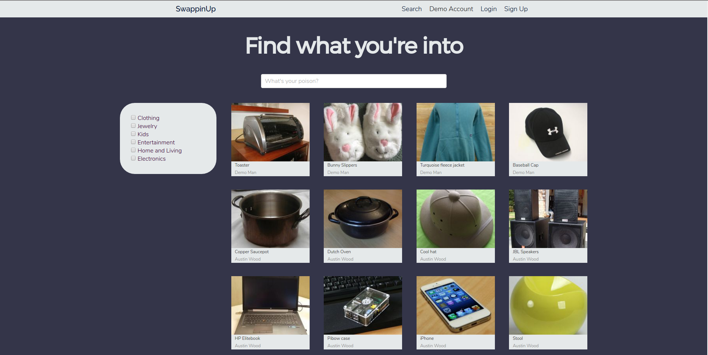
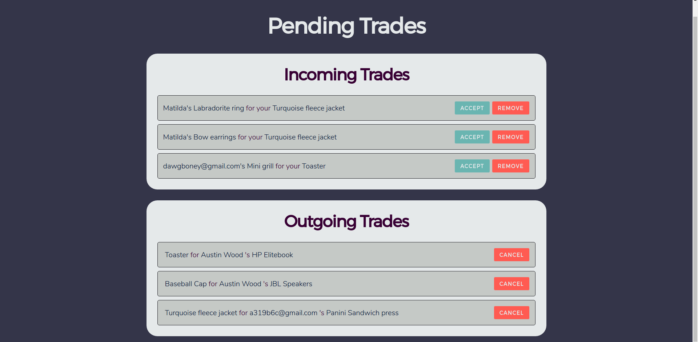

# SwappinUp

SwappinUp is a full-stack web application inspired by Etsy. It's built on top of a React-Redux frontend, Ruby-on-Rails backend, Cloudinary image hosting, and Postgresql database.

[SwappinUp on Heroku][Heroku]

[Heroku]: https://swappin-up.herokuapp.com/#/

## Concept

The idea of SwappinUp is not far from that of a garage sale, except money does not change hands. Instead, users fill their 'garage' with their own items and try to use them to barter for other users' items. The motivation is that, if two people are trading items, they're both getting more for less (from their perspective, anyway). In essence, everyone trades up.

## Features

### Live searching



The main design challenge of this site was, and still is, the ability to search for items that are relevant to you. While there is still some work to be done regarding searching for relevant items, the search is still dynamic and flexible, and it's all thanks to the heavy lifter of this react app: the `Item Index`.

The `Item Index` is responsible for rendering items on any page it's called, but rather than giving it an array of items to display, it's only given an object with search parameters. Any change in these parameters causes it to perform a new search, and thus is incredibly flexible in that any component that includes it only needs to modify search parameters and pass them in (or add them to the state). For example, the garage simply tells it that it needs all items from any category with an owner id equal to that of the id in the url. The moment the id changes in the url, the `Item Index` knows to perform a new search. In the search, it sets the parameters equal to whichever categories are selected, and whichever keywords are written in the search bar.

The code responsible for this flexible searching is located in a helper method in the Rails backend. When the api call is made, all search parameters are stored in the query string, and retrieved through the `params` hash in Rails. Each potential parameter is extracted and processed, building a single `item_params` hash that is then passed into an ActiveRecord search. 

```Ruby
item_params = {}
# For each item, only incude in item_params if it exists
user_id = params[:user_id]
item_id = params[:item_id]

item_params[:owner_id] = params[:user_id] unless user_id && user_id.empty?
item_params[:id] = params[:item_id] if item_id

category = params[:category]
if category && category != "all"
  item_params[:category] = []
  Item.categories.each do |cat|
    item_params[:category].push(cat) if category[cat] == "true"
  end
  item_params.delete(:category) if item_params[:category].empty?
end

items = Item.where(item_params)
```

Further processing is necessary to extract only items with specific keywords if the `search_words` parameter is set. A (potentially inefficient) function builds a frequency map of any items with the keywords in the name or description, then builds an array of those items. The array is ordered such that the items containing more keywords appear first.

```Ruby
def freq_list(items, words)
  # Could probably be more efficient, but I would require more done on the 
  # database level
  score_hash = Hash.new(0)
  words.each do |word|
    item_matches = items.where("name ILIKE ?", "%#{word}%")
    item_matches |= items.where("description ILIKE ?", "%#{word}%")
    item_matches.each do |item|
      score_hash[item] += 1
    end
  end
  
  score_hash.keys.sort { |a, b| score_hash[b] <=> score_hash[a] }
end
```

This function also removes any items not containing the search words.

### Trade conflict resolution



Trades are stored in the database with an `id` for the sender and receiver (the person who initiated the trade and the other user respectively), as well as an `id` for their respective items. The trade has two states:

- Pending
- Complete

Technically, if you count "not being in the database" as a state, there are three. This is key.

If a trade completes that would invalidate any other beginning or pending trades, they will be purged from the database. This sounds pretty cruel, but it's necessary. 

Imagine four users Alice, Bob, Charlie, and Dan. For the moment, trades only exist between two people, and thus, if Alice and Bob both want to trade for Charlie's cool sunglasses, and Charlie chooses to trade them for Alice's keyboard, Bob's pending trade should not still exist, as that would potentially flood Alice's pending trades, assuming they carry over with the item (the opposite scenarie makes no sense, wherby Charlie keeps a trade request for an item he no longer owns).

There's another group of trades that must be purged on the acceptance of another trade. If many other users were requesting a trade for Alice's hat before she traded it, the same problems would apply before. Thus, a solution:

```Ruby
def remove_conflicts(trade)
  Trade.where(
    "id <> ? AND (request_item_id = ? OR offer_item_id = ? OR request_item_id = ? OR offer_item_id = ?)", 
    trade.id, 
    trade.request_item_id,
    trade.request_item_id,
    trade.offer_item_id,
    trade.offer_item_id
  ).destroy_all
end
```

After the items are traded, any trades involving either item (excluding the initial trade that started this) are destroyed.

## Pending features

This site is nowhere near completion, and has many potential avenues for improvement. Here are the most obvious ones in order of how likely they are for me to implement soon:

- Improved keyword and partial matching
- Item tags for improved search
- Allowing multiple photos per item
- Improved layout and design
- More categories (and sub categories)
- Professionally designed logo
- User bio
- User messaging

Polytrades belong in the above list, yet it's hard to state where. One of the original motivations behind SwappinUp (though not the version presented here) is the idea than many people can be a part of a single trade, and that many users can agree to perform a single trade. This trade could take the form of a circular trade, where Alice gives her item to Bob, Bob gives his to Charlie, and Charlie gives his to Alice. The trade could also involve a zig zag where many users mesh their trades, and everyone get's what they want. The complexity behind finding these trades, as well as the difficulty in getting every user to agree to partake, will make this very difficult to implement.